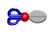



## Animated GIF ActiveX control

### Description

This ActiveX allow you to use animated gifs in your

applications. I saw examples of modules before but

not ActiveX.You can make OCX file from this and use it

in other applications.
 
### More Info
 
This is test application for using animated gif.

ActiveX has Propertie: GifPath must be a valid path

to an animated gif file

Methods:

StartGif - Loads gif and starts animation

StopGif -Stop the animation

ContinueGif-Continue animation

             |
---                |---
**Submitted On**   |2000-02-10 13:12:16
**By**             |[German Bletel](https://github.com/Planet-Source-Code/PSCIndex/blob/master/ByAuthor/german-bletel.md)
**Level**          |Advanced
**User Rating**    |4.4 (22 globes from 5 users)
**Compatibility**  |VB 5\.0, VB 6\.0
**Category**       |[Custom Controls/ Forms/  Menus](https://github.com/Planet-Source-Code/PSCIndex/blob/master/ByCategory/custom-controls-forms-menus__1-4.md)
**World**          |[Visual Basic](https://github.com/Planet-Source-Code/PSCIndex/blob/master/ByWorld/visual-basic.md)
**Archive File**   |[CODE\_UPLOAD33282102000\.zip](https://github.com/Planet-Source-Code/german-bletel-animated-gif-activex-control__1-5986/archive/master.zip)

